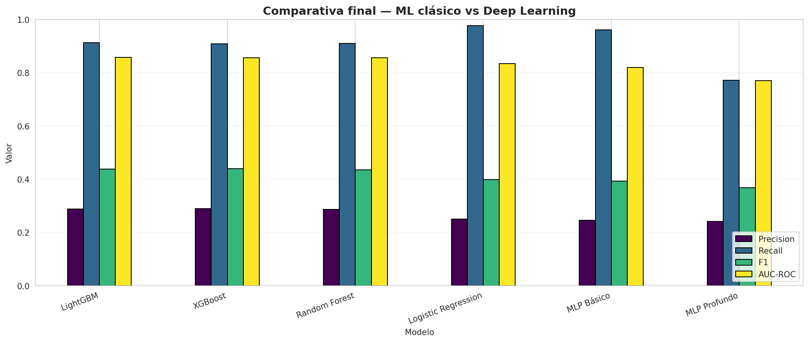
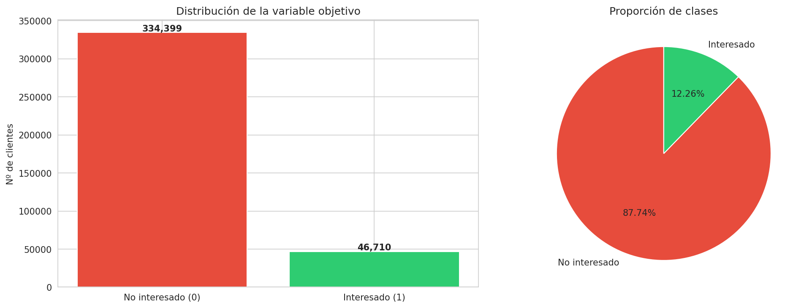
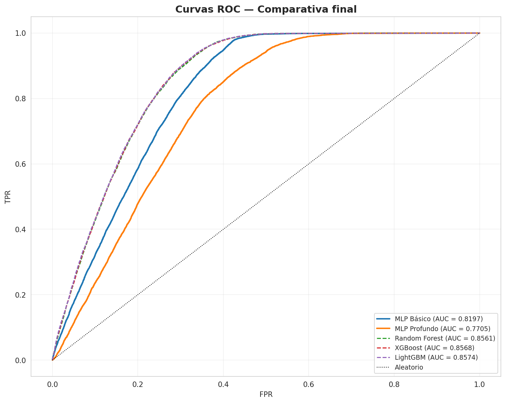
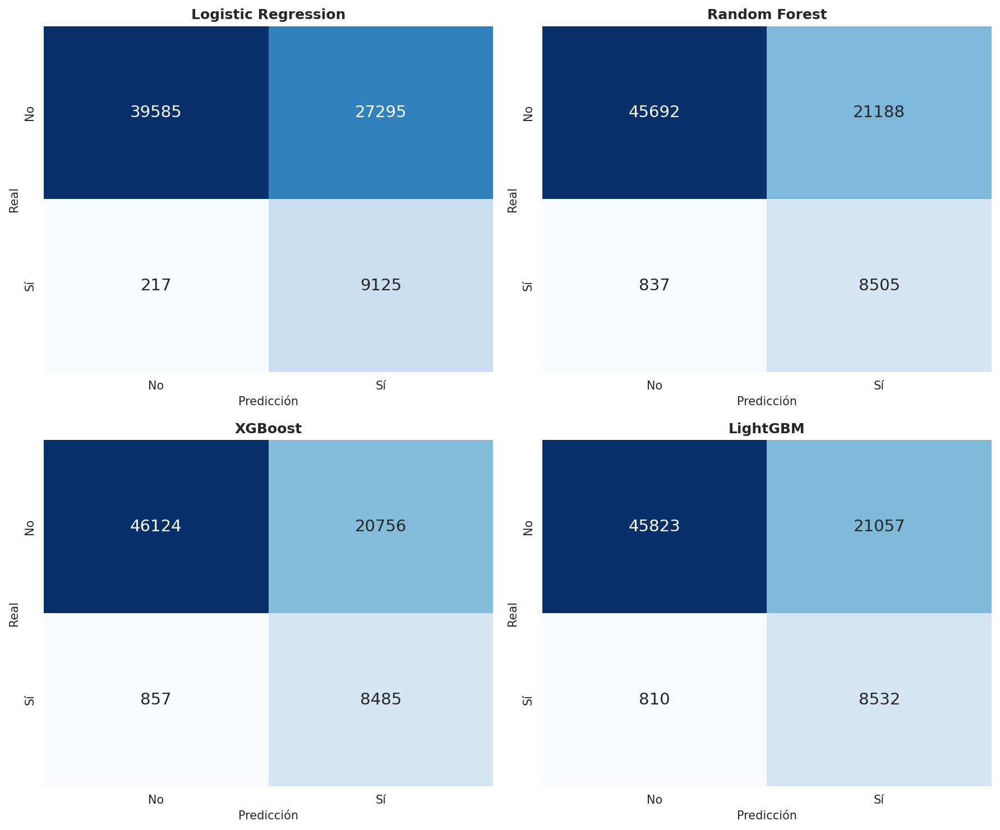
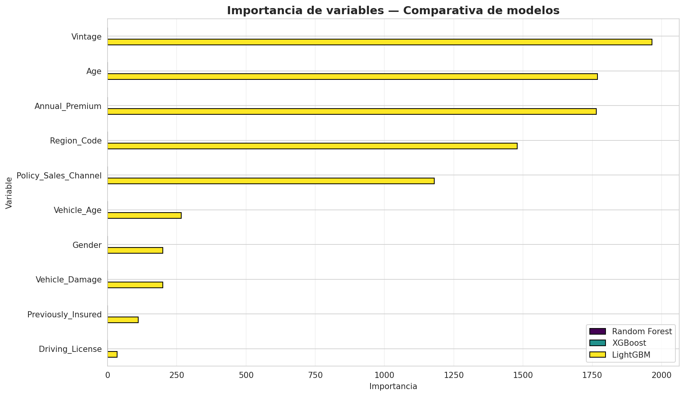
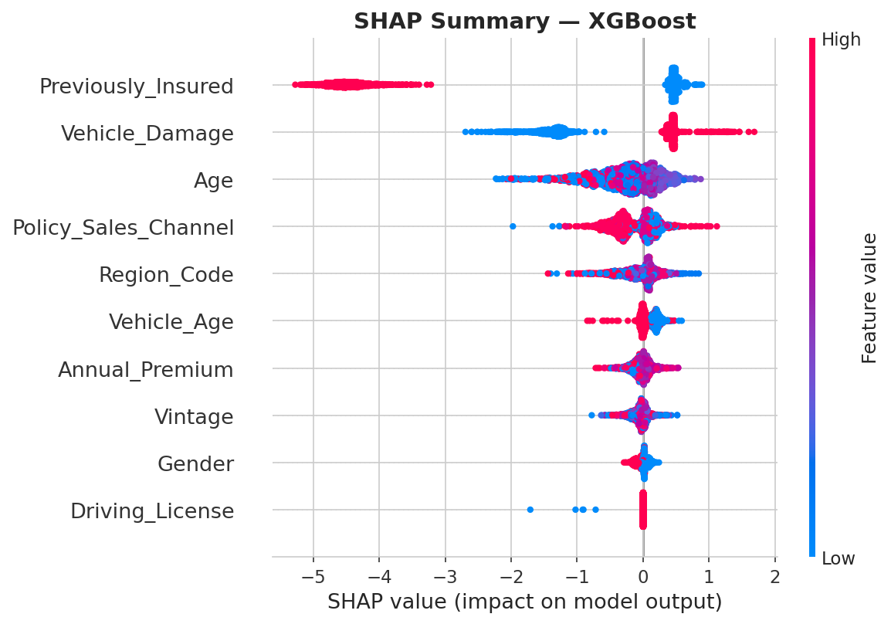
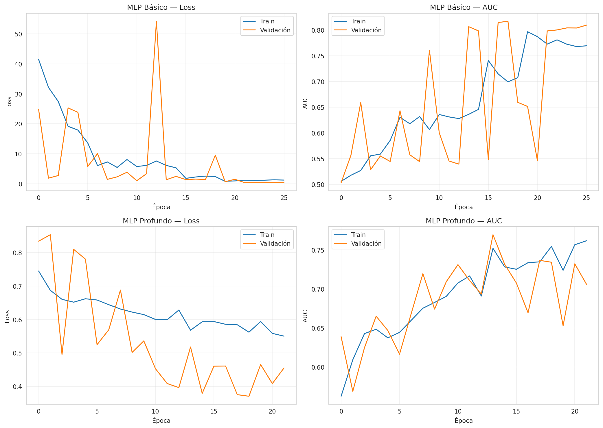

# 🧠 Reto 2 — Predicción de Venta Cruzada en Seguros de Salud

[](https://www.python.org/)
[](https://tensorflow.org/)
[](https://keras.io/)
[](https://scikit-learn.org/)
[](https://xgboost.readthedocs.io/)
[](https://lightgbm.readthedocs.io/)
[](https://shap.readthedocs.io/)
[](https://jupyter.org/)
[](LICENSE)
[]()

> **Curso:** Business Intelligence y Big Data (Nivel 5) | Odisea Data
> **Reto:** Implementación de algoritmos avanzados de IA en Business Analytics
> **Dataset:** [Health Insurance Cross Sell Prediction (Kaggle)](https://www.kaggle.com/datasets/anmolkumar/health-insurance-cross-sell-prediction)
> **Entorno:** Google Colab + Python 3.10+

---

## 🎯 Resumen

Modelo predictivo de **clasificación binaria** para identificar qué clientes de una compañía de seguros de salud tienen mayor probabilidad de contratar un seguro de vehículo (**venta cruzada**).

**Resultado principal:** modelo **LightGBM** con **AUC-ROC de 0,8574**, capaz de detectar el **91% de los clientes interesados**.

---

## 🏆 Resultados destacados

| Modelo | AUC-ROC | F1-score |
|---|---:|---:|
| 🥇 **LightGBM** | **0,8574** | 0,4383 |
| 🥈 XGBoost | 0,8568 | 0,4398 |
| 🥉 Random Forest | 0,8561 | 0,4358 |
| Logistic Regression | 0,8336 | 0,3988 |
| MLP Básico (Deep Learning) | 0,8197 | 0,3924 |
| MLP Profundo (Deep Learning) | 0,7705 | 0,3685 |

📊 **Comparativa visual:** 

---

## 🗺️ Pipeline del proyecto

| # | Fase | Notebook / Ubicación |
|---|---|---|
| 1 | Selección del dataset | `data/raw/` |
| 2 | Preparación del entorno | `requirements.txt` |
| 3 | Exploración y EDA | [notebooks/01_exploracion.ipynb](notebooks/01_exploracion.ipynb) |
| 4 | Limpieza y transformación | [notebooks/02_preparacion.ipynb](notebooks/02_preparacion.ipynb) |
| 5a | Modelos ML clásicos | [notebooks/03_modelos_ml.ipynb](notebooks/03_modelos_ml.ipynb) |
| 5b | Modelos Deep Learning | [notebooks/04_modelos_deep_learning.ipynb](notebooks/04_modelos_deep_learning.ipynb) |
| 6 | Evaluación comparativa | [notebooks/03_modelos_ml.ipynb](notebooks/03_modelos_ml.ipynb) |
| 7 | Interpretabilidad (SHAP) | [notebooks/05_interpretabilidad.ipynb](notebooks/05_interpretabilidad.ipynb) |
| 8 | Recomendaciones de negocio | [reports/recomendaciones.md](reports/recomendaciones.md) |

---

## 🔍 Hallazgos principales

### Top 3 variables más influyentes

1. **`Previously_Insured`** — Los clientes ya asegurados casi nunca contratan (tasa de conversión ~0,1%).
2. **`Vehicle_Damage`** — Los clientes con vehículo dañado convierten **~46 veces más**.
3. **`Age`** — Los clientes entre 30 y 50 años muestran la mayor propensión.

### Insights de negocio

- ✅ **Excluir clientes ya asegurados** ahorra ~45% del coste de campaña.
- ✅ **Concentrar el 80% del esfuerzo comercial en el 11% de clientes** con mayor probabilidad.
- ✅ **Aplicar el modelo a otros productos** (hogar, vida) para escalar el ROI.

📊 **Informe completo:** [reports/informe_analisis.md](reports/informe_analisis.md)
💼 **Recomendaciones de negocio:** [reports/recomendaciones.md](reports/recomendaciones.md)
📈 **Análisis de KPIs:** [reports/analisis_kpi.md](reports/analisis_kpi.md)

---

## 📦 Estructura del proyecto

```
reto2-ia-business-analytics/
│
├── data/
│   ├── raw/                          # Dataset original de Kaggle
│   ├── processed/                    # Datasets procesados (train/test)
│   └── external/                     # Datos externos (train.csv)
│
├── notebooks/                        # Jupyter Notebooks por fase
│   ├── 01_exploracion.ipynb
│   ├── 02_preparacion.ipynb
│   ├── 03_modelos_ml.ipynb
│   ├── 04_modelos_deep_learning.ipynb
│   └── 05_interpretabilidad.ipynb
│
├── scripts/                          # Código reutilizable
│
├── models/
│   ├── trained/                      # Modelos entrenados (.pkl, .keras)
│   │   ├── lightgbm.pkl
│   │   ├── xgboost.pkl
│   │   ├── random_forest.pkl
│   │   ├── logistic_regression.pkl
│   │   ├── mlp_basico.keras
│   │   └── mlp_profundo.keras
│   └── scalers/
│       └── scaler.pkl
│
├── outputs/
│   ├── charts/                       # 17 gráficos PNG
│   ├── metrics/                      # 5 CSVs con métricas
│   └── screenshots/
│
├── reports/                          # Informes (MD + PDF)
│   ├── informe_analisis.md / .pdf
│   ├── recomendaciones.md / .pdf
│   └── analisis_kpi.md / .pdf
│
├── presentation/                     # Presentación final (PPTX)
│
├── requirements.txt
├── .env.example
├── .gitignore
├── LICENSE
└── README.md
```

---

## 🚀 Cómo ejecutar

### En Google Colab

1. Abre el notebook deseado desde `notebooks/`.
2. Súbelo a Colab (`Archivo > Subir notebook`).
3. Ejecuta las celdas en orden.

### En local

```bash
git clone https://github.com/jdthgp27/reto2-ia-business-analytics.git
cd reto2-ia-business-analytics

python -m venv venv
source venv/Scripts/activate   # Windows (Git Bash)
# source venv/bin/activate     # macOS / Linux

pip install -r requirements.txt
jupyter notebook
```

---

## 🛠️ Stack tecnológico

<p align="center">
  
  
  
  
  
  
</p>

| Área | Tecnologías |
|---|---|
| **Lenguaje** | Python 3.10+ |
| **Datos** | pandas, NumPy |
| **ML clásico** | scikit-learn, XGBoost, LightGBM |
| **Deep Learning** | TensorFlow, Keras |
| **Interpretabilidad** | SHAP |
| **Visualización** | Matplotlib, Seaborn |

---

## 📸 Visualizaciones destacadas

### Distribución del target



### Curvas ROC



### Matrices de confusión



### Feature importance comparada



### SHAP Summary



### Curvas de entrenamiento (Deep Learning)



---

## 📦 Entregables

| # | Entregable | Ubicación |
|---|---|---|
| ✅ | **Código del proyecto** | [notebooks/](notebooks/) + [scripts/](scripts/) |
| ✅ | **Informe del análisis** | [reports/informe_analisis.pdf](reports/informe_analisis.pdf) |
| ✅ | **Modelo entrenado reutilizable** | [models/trained/](models/trained/) |
| ✅ | **Presentación de resultados** | [presentation/](presentation/) |
| ✅ | **Recomendaciones de negocio** | [reports/recomendaciones.pdf](reports/recomendaciones.pdf) |
| ✅ | **Análisis de KPIs** | [reports/analisis_kpi.pdf](reports/analisis_kpi.pdf) |

---

## 🎓 Conclusiones

Este proyecto demuestra que:

1. **LightGBM supera a Deep Learning** en problemas tabulares de clasificación binaria con clases desbalanceadas.
2. **La interpretabilidad con SHAP** permite traducir el modelo en **decisiones de negocio accionables**.
3. **El 80/20 se cumple**: concentrar el esfuerzo en el 11% de clientes con mayor probabilidad captura el 80% de las conversiones potenciales.

El modelo es directamente aplicable a campañas de **venta cruzada**, con un ahorro estimado del **45% en costes de campaña**.

---

## 🔄 Próximas mejoras

- [ ] Optimización de hiperparámetros con Optuna
- [ ] Probar CatBoost como alternativa
- [ ] Despliegue del modelo como API REST (FastAPI)
- [ ] Dashboard interactivo con las predicciones
- [ ] Análisis de coste-beneficio por umbral de decisión
- [ ] Calibración de probabilidades

---

## 👤 Autora

**Judit Giravent Pineda**

- Business Analytics Student | Odisea Data
- GitHub: [@jdthgp27](https://github.com/jdthgp27)
- LinkedIn: [linkedin.com/in/judit-giravent-27b167156](https://linkedin.com/in/judit-giravent-27b167156)
- Email: jdthgp27@gmail.com

---

## 📜 Licencia

Este proyecto está bajo la **Licencia MIT**. Consulta el archivo [LICENSE](LICENSE) para más detalles.

---

*Proyecto desarrollado como parte del curso **Business Intelligence y Big Data** de Odisea Data. Septiembre 2026.*

---

⭐ Si este proyecto te ha resultado útil, considera darle una estrella en GitHub.